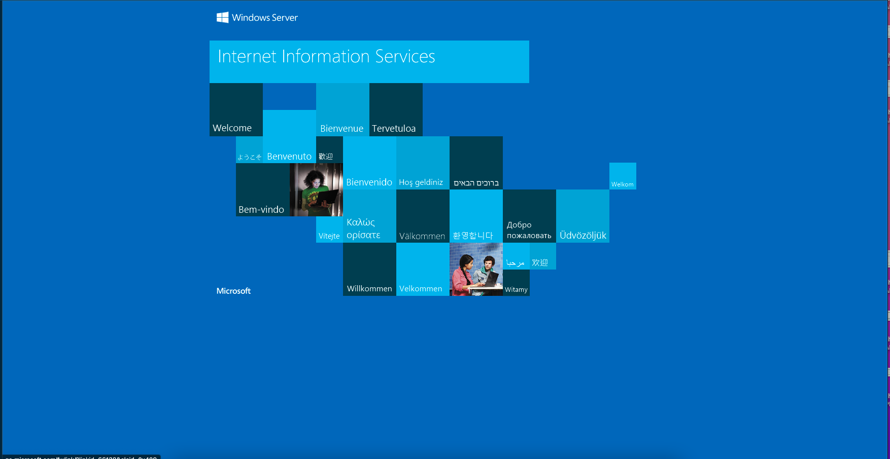

# Windows 2022 Server Overview

Installing a Windows Operating System from a mounted iso as part of your Packer build requires an answer file. 

For more information on how to create and customize an answer file, see [answer files](https://docs.microsoft.com/en-us/windows-hardware/manufacture/desktop/update-windows-settings-and-scripts-create-your-own-answer-file-sxs?view=windows-11) and [unattend](https://docs.microsoft.com/en-us/windows-hardware/customize/desktop/unattend/) docs.

In addition to the OS install, WinRM is enabled and is used as the  Communicator for Packer.

PowerShell provisioner scripts generalize and configure the vhd for upload to Azure. In addition, a web server is started on port 80 and can be used to verify the VM is running and accessible. 

## Usage

### Create the Image

Follow the steps in the top level [README](../../README.md) to configure and deploy the builder VM. Inside the builder VM, open PowerShell as Administrator and run the following commands to build an image from the `windowsserver2022` sample in this repo.


``` powershell
# Clone the repo
git clone https://github.com/Azure-Samples/nested-virtualization-image-builder --config core.autocrlf=input

# Build a sample Windows Server 2022 image
cd .\nested-virtualization-image-builder\images\windowsserver2022\
packer build .\windowsserver2022.pkr.hcl

# Use Managed Identity for azcopy
azcopy login --identity

# Use Managed Identity for azure-cli
az login --identity

$storageAccount = az deployment group show -g builder -n storage --query 'properties.outputs.storageAccount.value' -o tsv
azcopy copy '.\output-windows-server-2022\Virtual Hard Disks\packer-win2022.vhd' "https://$storageAccount.blob.core.windows.net/images/win2022.vhd"

# Register the image
az image create -g builder -n win2022 --os-type Windows --source https://$storageAccount.blob.core.windows.net/images/win2022.vhd

```

### Create the VM

```shell

# Create a resource group for the VM
az group create -n sample-vms -l westus3

# Create the VM. Save the public IP address for the verification steps 
IMAGE_ID=$(az image show -g builder -n win2022 --query id -o tsv)
az vm create -n win2022 -g sample-vms --image $IMAGE_ID --generate-ssh-keys 

```

### Verify the VM Web Server

Create an NSG rule to allow HTTP traffic to the newly created VM on port 80.

```shell
az network nsg rule create \
    --resource-group sample-vms \
    --nsg-name win2022NSG \
    --name port_80 \
    --protocol tcp \
    --priority 500 \
    --destination-port-range 80
```

It may take a few minutes for the VM to be in the running state and the NSG rule to take effect. Once the VM is running, navigate to the public IP address of the newly creted VM.

You should see a web page of the following:




### Clean up

```shell
az group delete -n builder
az group delete -n sample-vms
```


## Resources

- [Answer Files](https://docs.microsoft.com/en-us/windows-hardware/manufacture/desktop/update-windows-settings-and-scripts-create-your-own-answer-file-sxs?view=windows-11)
- [Unattend Reference](https://docs.microsoft.com/en-us/windows-hardware/customize/desktop/unattend/)
- [Unattend Components](https://docs.microsoft.com/en-us/windows-hardware/customize/desktop/unattend/components-b-unattend)
- [Packer - Hyper-V from ISO](https://www.packer.io/plugins/builders/hyperv/iso)
- [Packer - autounattend Windows](https://www.packer.io/guides/automatic-operating-system-installs/autounattend_windows)
- [Packer - WinRM Communicator](https://www.packer.io/docs/communicators/winrm)